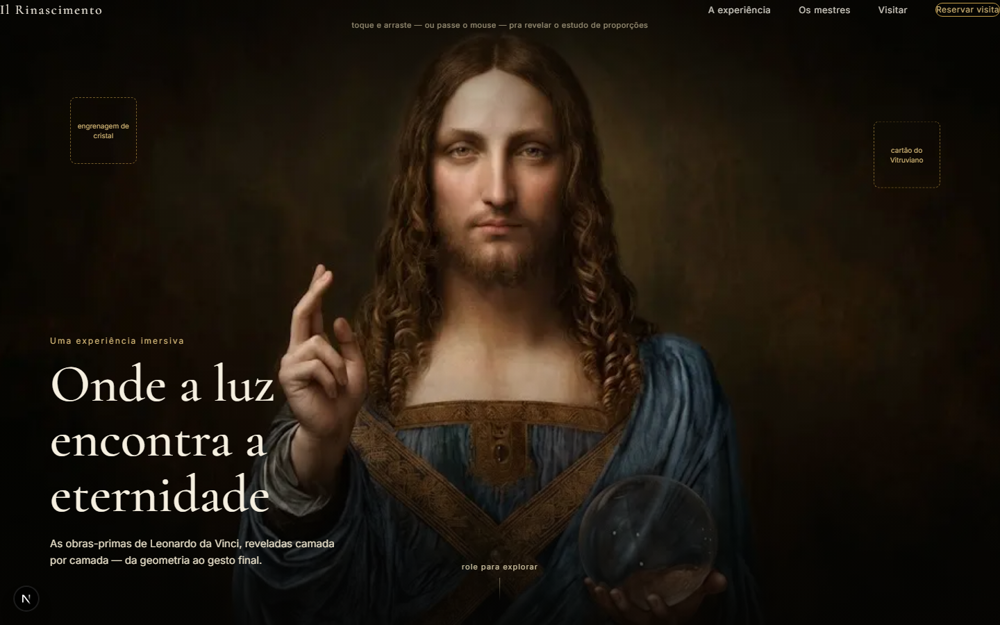
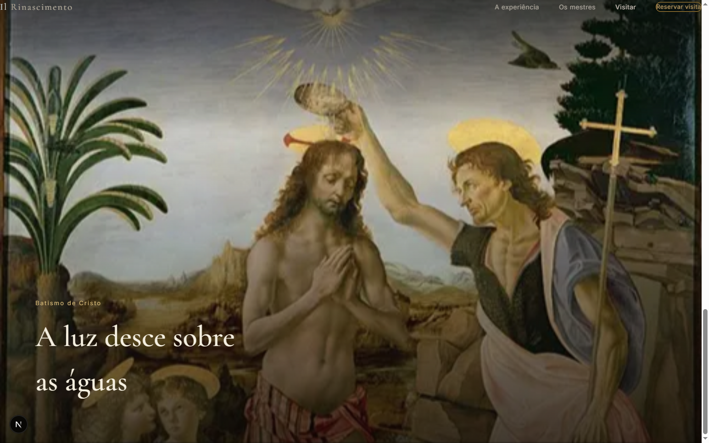

# Il Rinascimento

Uma experiência imersiva pelas obras-primas de Leonardo da Vinci — scroll-driven, com transições que revelam cada pintura camada por camada, da geometria do estudo ao gesto final da obra.

Projeto de portfólio construído pra explorar animação de alto nível (o tipo de interação premiada em coisas como o Awwwards) dentro de um stack de produção real, com atenção a performance e acessibilidade — não só a peça visual.



## O que tem aqui

- **Reveal em tinta, de verdade** — passar o mouse (ou arrastar, no touch) sobre o retrato do *Salvator Mundi* pinta um rastro que revela o estudo de proporções por baixo. Não é uma máscara circular: é um shader WebGL próprio (Three.js), com um buffer de acumulação ping-pong que registra o trajeto do cursor — passar rápido deixa um risco fino, "de tinta jogada"; passar devagar preenche um borrão grosso — e o rastro decai sozinho, de forma suave e independente do frame rate, até sumir.
- **Zoom de câmera pinado** — o scroll mergulha a câmera exatamente no orbe de cristal que Cristo segura, com `transform-origin` calibrado na posição real da imagem, não num ponto genérico da tela.
- **Transição por cor, não por corte** — o mergulho no orbe termina no mesmo azul-acinzentado do vidro (amostrado por pixel da própria imagem) e a cena seguinte, o *Batismo de Cristo*, entra já enquadrada num trecho limpo do céu na mesma paleta — a pintura "acorda" dessa cor conforme a câmera se afasta e revela a cena inteira.



- **Acessibilidade de verdade, não checkbox** — quem tem `prefers-reduced-motion` ativado recebe uma transição em crossfade simples no lugar do zoom de 18x, via `gsap.matchMedia()`. O efeito de assinatura não é obrigatório pra navegar o site.

## Stack

| | |
|---|---|
| Framework | [Next.js 16](https://nextjs.org) (App Router) + TypeScript |
| Animação | [GSAP](https://gsap.com) + ScrollTrigger |
| Reveal em tinta | [Three.js](https://threejs.org) — shader GLSL próprio, buffer de acumulação em ping-pong |
| Smooth scroll | [Lenis](https://lenis.darkroom.engineering), sincronizado ao ticker do GSAP |
| Estilo | Tailwind CSS v4 para layout, CSS Modules para os efeitos (filtros, gradientes, blends) |
| Imagens | `next/image` |
| Fontes | `next/font/google` (Cormorant Garamond + Inter) |

GSAP não foi feito pensando em React por padrão — ele manipula o DOM diretamente. Cada componente que anima usa `gsap.context()` dentro de um efeito de layout isomórfico, com cleanup no unmount, pra evitar vazamento de memória e efeitos duplicados no Strict Mode.

## Rodando localmente

```bash
npm install
npm run dev
```

Abre em [http://localhost:3000](http://localhost:3000).

## Estrutura

```
src/
  app/                    # rotas (App Router)
  components/
    nav/                  # navegação fixa, mix-blend-mode: difference
    hero/                 # seção do Salvator Mundi — reveal em tinta (WebGL), zoom, portal
    sections/             # demais obras da jornada
    SmoothScroll.tsx       # ponte entre Lenis e o ScrollTrigger do GSAP
  hooks/
    useIsomorphicLayoutEffect.ts
  lib/
    gsap.ts               # registro do plugin ScrollTrigger
```

## Status

Em construção. A jornada atual cobre o *Salvator Mundi* → *Batismo de Cristo*. Próxima obra e os objetos decorativos flutuantes (as caixas tracejadas no hero) ainda entram.
